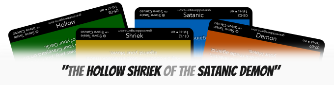
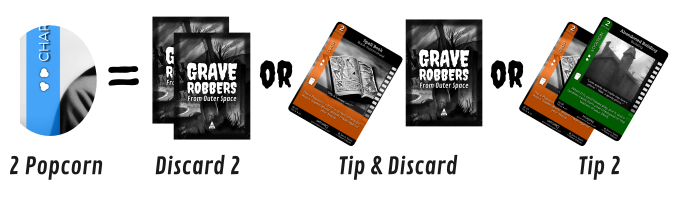
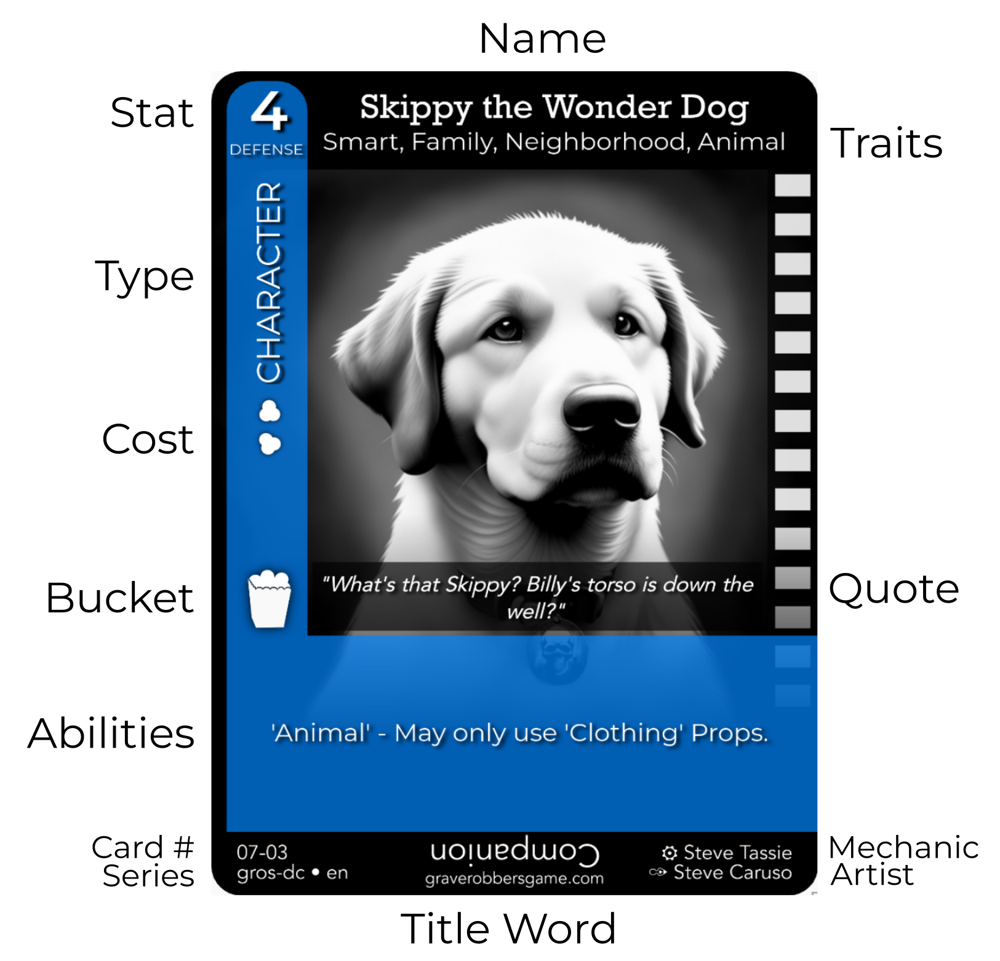
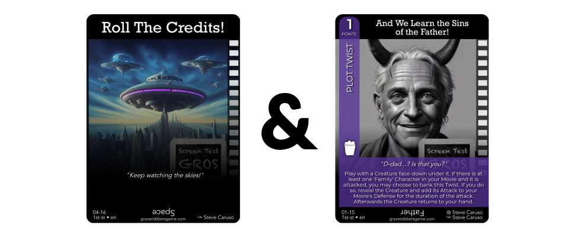
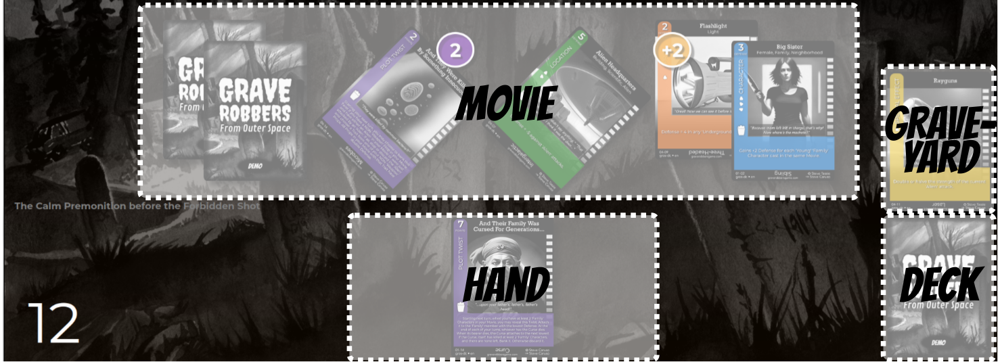
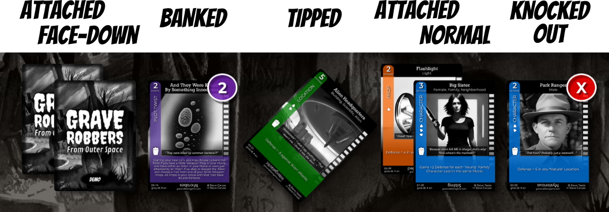

# The Rules (2024.06.06)

# Grave Robbers From Outer Space (GROS)
## Presented by The Academy of Resurrected Games and Holdings (A.R.G.H.)

Welcome to Grave Robbers From Outer Space (GROS), an open source collectible card game that *you* can contribute to!

In this game you take on the persona of a director who is trying to build up a B-movie with Locations, Characters, and Props, while defending their movie from Creatures played upon them from rival directors. The movie with the highest ratings when the credits roll, wins.

## Official Contact

Any and all inquiries about the Game, the Rules, or the Community should be fielded to [graverobbersgame@gmail.com](mailto:graverobbersgame@gmail.com).

## Copyright Notice

The original Grave Robbers From Outer Space series is copyright Stephen Tassie and used with permission.

All art assets involved in this project are released under the [GROS Free License](/license).

## Playing the Game

**NOTE:** As of May 2024, **Standard Play** has been changed to the **Feature Film** format, which we'll be explaining here. If you are interested in the shorter Episode rules, or how to play by the Classic rules, take a look at the [Other Formats](#other-formats) section.

GROS can be played with 2-6 players, but the sweet spot is really 2-4.

### Deck Building and Feature Packs

To start, each Player builds a deck of **50 unique cards**, including 3 ***Roll the Credits*** cards. The rest of the body of your deck can be any combination of card types, but if you keep approximately to the following ratios it tends to stay well-balanced:

* 10 Characters
* 10 Creatures
* 9 Special Effects
* 6 Locations
* 6 Props
* 6 Plot Twists
* 3 Roll the Credits

If it's your *very first* time playing, it's recommended that you play using **Feature Packs**.

Starting with the new Director's Cut, each Season of the game is broken up into a number of 16 card Feature Packs built along a particular theme, and are balanced with appropriate Plot Twists. Each of these also include a themed Roll the Credits art card as well.

Each Pack will be outlined on the **[Card List](/cards/)** for its release.

Standard decks can be readily made by choosing 3 Feature Packs, and picking two additional cards of your choice. Shuffle them all together and you're ready to play.

### Movie Title

If your Movie does not [already have a Title](#titled-decks), each player shuffles their deck and reveals **4 cards**.

Using the upside-down **Title** words at the bottom of each card and adding in short words like "the" or "of", one creates a Title for their Movie.

For example, if we have "Demon," "Hollow," "Shriek," and "Satanic" we could have:

- "The Hollow Shriek of the Satanic Demon!"

Write down the Title on a piece of paper where they can be seen during play and shuffle the cards back into the deck. Each word in the Title may be worth bonus points in your Final Score.

### Initial Set Up

Each player draws 6 cards. If the initial draw has no Characters with a positive Defense, they may reveal and discard that hand and draw 6 more cards. This may be repeated as many times as necessary.

Once everyone has at least one Character in-hand, any discarded cards are shuffled back into their Deck.

All Players then place **one of their Characters** from their starting hand face up in front of them after reading the Quote on the card.

They then figure out who goes first by comparing the Characters they've played:

- The one with the **lowest Defense** goes first.
- If there's a tie, the one with the **fewest Popcorn pips** goes first. (see: [Popcorn](#popcorn) below)
- If there's still a tie, the one **without a Popcorn Bucket** goes first.
- If there's *still* a tie, **flip a coin!**

Play proceeds clockwise from there.

### The Establishing Shot: The First Round of Play

The **Establishing Shot** is the first round of the game, where each Player is *only allowed to affect their own Movie*. No Creatures or Special Effects or anything else that meddles with the other Movies are allowed.

After the first round is over, play begins normally and the gloves come off.

### Order of Play

On their turn, each Player performs the following actions, in order:

1. **Fill Up** - All Popcorn is filled back up (see: [Popcorn](#popcorn) below) and the Player draws their hand up to their maximum. (6 in Standard Play, but some cards can change this.) If you went first, you skip your first Fill Up step.

1. **Play** – A Player may play as many cards as they can afford. Any type of card may be played during your turn in any order, but Special Effects cards are the only type that can be played by someone who isn't the active Player. Props and Characters are generally added to your own movie, while Creatures are used to attack your opponents (see: [Attacks](#attacks)). Locations can be played into any Movie, and Special Effect cards do whatever is printed on them. Further details of the workings of each type of card are found in the [Card Types](#the-cards) section of the rules below.

1. **Discard** – Once you have played all the cards you wish to, if you are above your hand limit, you must discard the excess into your Graveyard. You may always choose to discard more cards than you are obligated to throw away. Discarding without generating an effect is a signal that your turn is over.

## Popcorn

To play a card, you must generate and pay the appropriate amount of **Popcorn** first, which you may do at any time. Popcorn generally comes from two sources:

1. Any card you have in play that has the **Popcorn Bucket icon** can be independently **"tipped"** (that is rotated onto its side) for one kernel of Popcorn.

1. Any card a Player **purposefully discards from their hand** generates Popcorn – one kernel of Popcorn per card discarded. (Exception: Cards they must discard due to game effects or that they discard at the end of their turn do not generate Popcorn.)

The cost to play a card is the number of Popcorn kernels shown on the colored banner on the left of the card being played. If there are no kernels, the card may be played for free.

Tipped cards are otherwise regularly in play (i.e. their Abilities work, they count towards a Movie's Defense, etc.) and any tipped cards in a Movie are untipped when a Player Fills Up at the start of *their* turn.

Finally any Popcorn unspent when a turn passes, disappears — forever lost between the seats.

## The Cards

There are seven basic card types you will encounter in this game, and each of them has one or more of the following attributes:

* **Name** - The name of the card.
* **Art** - An illustration.
* **Quote** - A relevant flavor quote. (Not optional!)
* **Title** - A Title word upside down at the bottom.
* A **Stat** either **Defense** or **Attack** - Adds to the Defensive Strength of the Movie, or Attack Strength of a Creature; or a **Points** value that a Player may bank under certain circumstances.
* **Traits** - A list of adjectives that can affect play.
* **Abilities** - Special ability text or powers.
* **Popcorn Cost** - How much Popcorn the card costs to play.
* **Popcorn Bucket** - Whether or not a card produces Popcorn each turn.

The basic rules for these cards are as follows. (Note that if a card contradicts these rules, whatever is written on the card takes precedence.)

### Attaching

Certain cards can be **Attached** to other cards, to Movies, or to the table. Attachment represents an object or effect that sticks around. Cards that are Attached are usually played above or behind the cards they are Attached to — and in some cases Attached cards can have their own Attachments.

With few exceptions, when something happens to the base card, all Attached cards go along with it unless otherwise noted.

### "Printed" vs "Total"

A card's **Printed Defense** or **Printed Attack** refers to the raw Stat. However, a card's **Total Defense** or **Total Attack** refers to their Stat plus any bonuses from their own Abilities, attached cards, or other cards that affect them.

### Knocked Out

Sometimes game a game effect will **Knock Out** a card in play. A Knocked Out card is still in play, but its Total Defense and any Abilities are ignored. Often this is represented by turning them Face Down or using a **KO counter**. Any Attached cards to a Knocked Out card are also Knocked Out. 

When a player Fills Up at the beginning of their turn and when the game ends, all Knocked Out cards "wake up".

Now let's look at each card type:

### Characters

**Blue** — Characters are the stars of your movie and add to your Movie's Total Defense score. You want yours to live and you want your opponents' to die. There is no limit to the number of Characters you may have in your movie, and no limit to how many you can play in a single turn (assuming you can afford the cost). 

Most Characters are played into your own Movie, but some can be played on an opponent, where others can be used as Creatures or Special Effects instead (their Ability text will describe how). 

### Props

**Orange** — Props are weapons and tools used to buff your Characters (and occasionally Creatures). Except for the color difference, the overall anatomy of a Prop is the same as a Character card, except that **Props *must* be Attached to a Character when they are played**. They cannot simply lay around in a Movie. 

There is no limit to the number of Props a Character can have, but a Character can *only* obtain one new Prop per turn — this is the **Prop Limit**. Props may be moved from one Character to another during your turn so long as Limit is observed. When a Character dies, all their Props go to the Graveyard with them.

### Locations

**Green** — Locations are where Players' Movies take place and add to your Total Defense score. Each Player's Movie may have one Location in it at a time – although some Location cards can be **Combined** with existing Locations to make a larger Location made of multiple cards. When a new Location card is dealt *over* an old Location card, the old Location card is discarded, and any Combined Locations that can no longer be legally Combined with it must be discarded as well. You may play Location cards from your hand into any Movie during your turn.

### Creatures

**Red** — Creatures are played from your had to directly attack an Opponent's Movie in an attempt to kill a Character and are afterwards discarded. They are the only cards with an Attack value. Also, they never produce Popcorn. There is no limit to the number of Creatures you can play on a single turn, assuming you can afford them all, but each Creature attack is resolved individually. Creature attack rules are described in detail in the section on **[Attacks](#attacks)**.

### Special Effects

**Yellow** — "FX" cards do all manner of things for Players, from drawing extra cards, to boosting or weakening attacks, to flat out sending cards directly to the Graveyard. They are the only type that can be played by someone who isn't the active Player.

Special Effects are generally resolved in Last-In-First-Out order.

Where most Special Effects are discarded right after they are played and resolved, some Special Effects can attach to Characters, Props, or Locations for lasting effects, or can be played on the table and continue to affect the game until certain conditions are met. Some of these persistent Special Effects may produce Popcorn for their controller and as such bear a Popcorn Bucket icon to indicate this.

### Plot Twists

**Purple** — Plot Twists are a means of springing surprises upon your Opponents, earn you points, get you more Popcorn. In some formats they are used to end the game. 

Plot Twists have no Popcorn cost, and when you play one from your hand, you must conspicuously place it face-down to the side of your Movie. (You may peek at it whenever you want, but your opponents are not allowed to see which card it is — yet.)

Once the conditions in the Plot Twist's Ability text are met, you may turn it face up, and **Bank** the number of points displayed in the upper-left-hand corner. Banked points do not count towards a Movie's Defense, but they do count towards your final score. Once a Twist is Banked, any other Abilities they have come into play. Virtually all of them also generate Popcorn. Others may give you additional win conditions or grant you other tricks.

However, Plot Twists do have some limitations: You may only play one of them face-down per turn. They *can* be removed from Movies — and where this doesn't affect any Banked points, their Popcorn Buckets and Abilities don't work from the Graveyard or outside the game.

### Roll the Credits

**Black** — These cards are used to bring a standard game of GROS to an end (as described in the [The End](#the-end) section above).

Before you play a Roll the Credits you'll want to be wary of any Plot Twists on the board. Banked Points, where they don't count towards a Player's Defense, do count towards their final score (the same goes for Knocked Out cards). And then there's always the possibility that a Twist may go off when the credits roll. So be strategic when you Roll the Credits!

## Attacks

A Player initiates a Creature attack when playing a Creature card on another Player's Movie or when a card states that an attack is made — in which case that card is considered the attack's origin.

### Determining Success or Failure

First, compare the **Total Attack** of the Creature to the **Total Defense** of the target Movie. Don't forget to factor in modifications to either score generated by Special Effects, Attached cards, and Abilities in play. If the Attack score's total **equals or exceeds** the Defense score, the attack is **successful** (i.e. ties go to the Attacker). Otherwise it is a **failure**. 

Some Creatures have Characters that **cannot defend** against them. This means that not only those Characters' Total Defense doesn't count, but none of their Abilities or attached Abilities can be used in defense either. They are essentially cannot aid in the fight.

Some Creatures or Locations have attack types that **"always succeed"** or **"automatically succeed"**. In this case, the attack is successful regardless of the Attack and Defense. Some cards can **"stop"** an attack, in which case the attack is a failure regardless of the Attack and Defense.

Once the initial success or failure is determined, any Player may activate Abilities in play, or play additional Special Effects to alter the state of the attack – whether changing the Attack and Defense scores by various means or altering the success or failure. The attack is **resolved** once additional actions to mess with the attack cease.

### Finishing an Attack

Once that happens, if the attack is a success, the Attacker may choose one Character in the target Movie to be the **Victim**. (Some game effects may afford additonal Victims.) Unless stated otherwise, the Victim dies — they and their attachments are discarded into their Graveyard.

Regardless of the outcome, once an attack is over, the Creature (if there is one), plus all other cards exhausted in the attack (i.e. Special Effects, Props given to Psychos, etc.) — unless otherwise stated – also go to their respective Graveyards.

The active Player may make as many attacks as they can afford in a single turn, but each is resolved independently before the next one is made.

### Direct Affect Rule

A final note: Only Special Effects, Abilities, and other things that *directly affect the outcome of the attack* are playable until the Attack is fully resolved. For example, playing *"Production Value"* to add +2 to a 'Female' Character in the defending Movie could save the defending Movie from the attack, but using *"Back to the Home"* to eliminate an 'Old' Character from the *attacking* Player's Movie has no impact on the attack, so it cannot be played until after it is over.

## Special Attacks

In addition to Creature attacks, there are special types of attacks as well which have slightly different rules.

### Duels

**Duels** are when a pair of *Characters* face off across Movies.

If a Player has a Character that is able to Duel in their Movie, they can tip that Character and choose an intended Victim in another Movie to declare a Duel attack.

The attack has all of the Traits of the attacking Character, plus any that are listed in the Character's Dueling ability text. For example, a 'Supernatural' Duel adds 'Supernatural' to the attack.

The base **Attack Strength** is equal to the Duelist's Total Defense.

The base **Defense Strength** is equal to the Victim's Total Defense plus their Location's Total Defense. (The fight is on the Victim's turf.)

Unless the Ability states otherwise, the loser of the Duel **dies**, but often other effects may come into play instead.

### Brawls

**Brawls** (formerly 'Kung Fu' attacks) are when *groups of Characters* across Movies face off.

If a Player has a Character that is able to Brawl in their Movie (such as a **'Kung Fu'** Character), they can tip that Character and choose an intended Victim in another Movie to declare a Brawl attack.

*Like a Duel,* the attack has all of the Traits of the attacking Character, plus any that are listed in the Character's Brawling ability text. For example, a 'Kung Fu' Brawl adds 'Kung Fu' to the attack.

The base **Attack Strength** is equal to the Brawler's **Total Defense**.

The base **Defense Strength** is equal to the Victim's Total Defense plus their Location's Total Defense.

*Unlike a Duel,* additional Characters that can Brawl may be tipped on either side to add their Total Defense and Traits to their side of the fight respectively.

Unless the Ability states otherwise, the loser of the Brawl (the initial Attacker or the Victim) is **Knocked Out**.

## The End

In a standard game, once a Player's Movie reaches 20 Total Defense (including all passive bonuses, minus any Knocked Out cards, etc.) they have the ability to try and end the game.

If they choose to do so, as the last action of their turn, they may play a **Roll the Credits** card which brings the game to **The Climax**:

* All Players, collectively, have one last chance to react with any **Special Effects, Plot Twists, or Abilities** in a bid to kill or Knock Out Characters, add additional bonuses or minuses, or otherwise change the final scores.

* At the end of this phase **if no one has a Movie that has at least 20 Defense, the Climax has failed** and the Roll the Credits is discarded. Play resumes with the next Player’s turn.

* **Otherwise the Credits Roll** (game is immediately over and scores are tallied; see [Final Scoring](#final-scoring) below).

**Another way the game can end,** is if a Player begins their turn with an empty deck (i.e. they've *"run out of plot"*). At that point the game is *immediately* over.

## Final Scoring

When the Movie is over, it's time to see how the audience liked it. **All Knocked Out cards wake up** (they survived!) and Players add up the following points values to determine their **Ratings**:

1. The **Total Defense** of all the cards in play in their Movie;

1. An additional **3 points** for each card bearing a **Title word** from the title of their Movie, both from both cards in play and cards in their hand; and

1. Finally they add in any points that they **Banked** during the game (see [Plot Twists](#plot-twists) below).

From there, **the Player with the highest Ratings is the winner!**

## Zones

There are a number of **Play Zones** where cards can live, and they are referred to by the following names:

* **Deck** — This is your stack of cards that are placed face-down on the table that you draw from.
* **Hand** — Where your cards end up after you draw them. The general hand limit is 6 cards, but this can change depending on the type of game or in-game effects.
* **Movie** — Where all the fun happens. This is the main play zone of the game where cards are considered ***in play*** and most are face-up. Sometimes we refer to "casting" Characters into one's Movie, which means putting them in play.
* **Graveyard** — A bit of important housekeeping when dealing with cards that are **discarded** or **killed**. These cards end up in their Owner's Graveyard regardless of the Movie they may currently be in or who controls them.
* **Removal** — This is the editing room floor. When a card is **removed from the game**, it is set aside from all other Play Zones and is *out of play* until the game is over (i.e. it's not coming back from the grave).

## Card States

Cards in GROS can have several states when they're *in play*:

* **Normal** or **Face-Up** — The general normal state of a card when it's in play is face up in your Movie. All of its Abilities are in effect if their requirements are met, and its Defense counts towards your Movie's total (or Attack against the Movie it's being played on, if it's a Creature).
* **Face Down** — A face down card is concealed with its face against the table. Plot Twists are played Face Down, and often some cards are played Face Down with them.
* **Tipped** — A Tipped card is rotated 45 or 90 degrees clockwise and represents that it's either been used for Popcorn or has been exhausted for an Ability or effect. Unless otherwise noted, Tipped cards retain all of their other Defense and Abilities. A card that is Tipped becomes "untipped" or Normal when its Player next Fills Up at the beginning of their turn.
* **Attached** — A card that is Attached is connected to another card (often placed above or partially behind it). If a card changes Zone, any cards Attached to it are generally discarded.
* **Combined** — Cards that are Combined (often Locations and Creatures) have their Defense/Attack and Traits treated as a single entity, but may be in other States (such as being Tipped) or moved between Zones separately.
* **Knocked Out** — A Knocked Out card is in play, but its Defense and Abilities are ignored until their Player next Fills Up. Often this is represented by turning them Face Down or using a counter. Any Attached cards to a Knocked Out card are also Knocked Out. Knocked Out cards ***do*** count towards the final score.
* **Banked** — A Banked Plot Twist is a Plot Twist that has locked in Points for its Owner for the end of the game. Generally they are Face Up and marked with a counter or die to indicate how many Points they represent.

## More About Abilities

**Abilities** are all of the special powers that a card has explained in their Abilities text.

A **Trait Ability** is an Ability granted by having a particular Trait. (See below.)

An **Activated Ability** is an ability with a listed cost (tipping, spending Popcorn, discarding cards, killing Characters) that must be satisfied first. Unless otherwise stated, Activated Abilities can be used like Special Effects.

## More About Traits

Traits are descriptive words or triggers that can be found on Characters, Creatures, Locations, and Props, or can be granted or removed by Special Effect cards or Abilities.

Some Traits are "opposed" to each other, such as:

* **Smart** / **Dumb**
* **Young** / **Old**
* **Male** / **Female**
* **Large** / **Small**

If a card gains a Trait in opposition to a previously existing Trait, the previous Trait is nullified. For example, if the Big Dumb Jock gets *"Edjumacated"* he is now just Smart, not both Dumb *and* Smart.

Other Traits grant specific Abilities which should also be written in the Ability text of the card (aka **Trait Abilities**). For reference, there are Trait Description references that can be played on the game table to keep track of these, but generally speaking:

* **Aquatic** – 'Aquatic' Creatures have double their printed Stat at an 'Aquatic' Location.
* **Cop** – 'Gun' Props have double their printed Stat in the hands of a 'Cop'.
* **Crew** – Actors and Production Crew members. They cannot be targeted by attacks or use Props.
* **Event** – Locations with the Trait 'Event' can be combined with existing Locations (i.e. Locations already in play) that share a Trait other than 'Event'. Otherwise they can be played on their own.
* **Ghoul** — Cannot defend against 'Vampires'. (Treat them as Knocked Out until the end of the attack.)
* **Psycho** – When a 'Psycho' attacks, any Player (not just the active Player) may play Weapon Props to boost the Psycho's Attack Strength. These Weapons are all sent to the Graveyard after the attack is resolved. Ignore the Popcorn cost of any Weapons played in such a manner.
* **Swarm** – 'Weapon' Props cannot defend against 'Swarm' attacks. (Treat them as Knocked Out until the end of the attack.)
* **Unlucky** – A Character who is 'Unlucky' must be targeted by an attack first, and Characters in their Ability text can be 'Unlucky' against certain kinds of attacks or situations. If multiple Characters are 'Unlucky' at a time, the Attacker may choose the victim among them.
* **Vampire** — Characters with the 'Vampire' Trait may launch non-lethal 'Supernatural' [Duels](#duels). Instead of killing a Victim, the Victim gains the Trait 'Ghoul'. (see above)

If you are playing a [Classic GROS](#classic-play) game, there are a bunch of Traits that work a little bit differently than are described here.

## Other Formats

Standard Play is not the only way to enjoy GROS. The following are alternative formats that present new challenges.

### Classic Play

Before Grave Robbers was resurected, there were several classic GROS sets that had slightly different set of mechanics:

**Format** – The format of Classic GROS play is "Central Casting". There is one central deck and one central Graveyard from which all players draw and discard.

**Hand Size** – The hand limit is 6.

**Popcorn** – Ignore the Popcorn costs to play cards and Popcorn Buckets to generate Popcorn. Any further references to Popcorn costs can be satisfied by discarding cards from your hand.

**Card Limitations** — Remove all Plot Twists from the deck, and include an appropriate number of Roll the Credits. (One for every 60 cards was the original ratio, or roughly one for every 40 cards in the Resurrected Edition. Adjust as necessary.)

### Episode Play

The prior Standard format consisted of playing an **Episode**:

**Format** – Each Player has their own Deck and their own Graveyard. When any one player Banks their third Plot Twist, the game is over at the end of their turn.

**Hand Size** – The hand limit is 6.

**Popcorn** – Standard Popcorn rules apply.

**Card Limitations** — Each Player's deck must consist of exactly 30 cards with exactly 4 Plot Twists and no Roll the Credits. (One can simply take two Feature Packs, remove the Roll the Credits, shuffle together and play.)

### Drafting

Playing a Draft is a fun way to get to know a new release, especially for Players who haven't seen a particular set of cards yet. The most common way to Draft is by playing a Season Episode of 30-ish cards.

Each Player is given a pack of 15 cards which they look over. From that pack they choose one card to add to their deck, and pass that pack to the player on their right. This continues, picking cards out, until each of them has 15 cards in their deck.

This is repeated one more time with 15 more cards per player, only this time passing the packs to the left, until each Player has 30 cards in their deck.

At this point some balancing might need to happen. If you're playing with Plot Twists, each player should have 4 appropriate ones in their deck. If you're playing with Roll the Credits cards, each player should have two.

At that point, the Players are ready to shuffle up, choose their Titles, and play.

### Titled Decks

A Titled Deck is Standard Play of an Episode or Feature Film, but instead of drawing a Title at the beginning of the game, the deck is *built* around a pre-established Title with all cards having to fit that Title's general premise.

For example, if one were to have the Title mentioned earlier *"The Dreadful Demonic Crypt of the Evil Warlock Boyfriend"*, the Deck would need to be built with the six cards that made that Title, along with Characters, Creatures, Locations, and Special Effects that are all on theme (demons, undead, witches and warlocks, family or romantic characters, etc.).